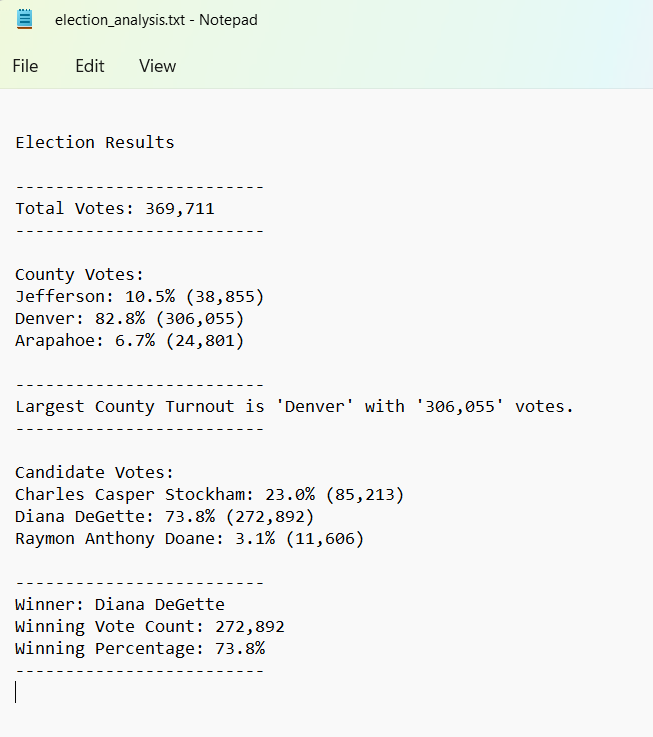
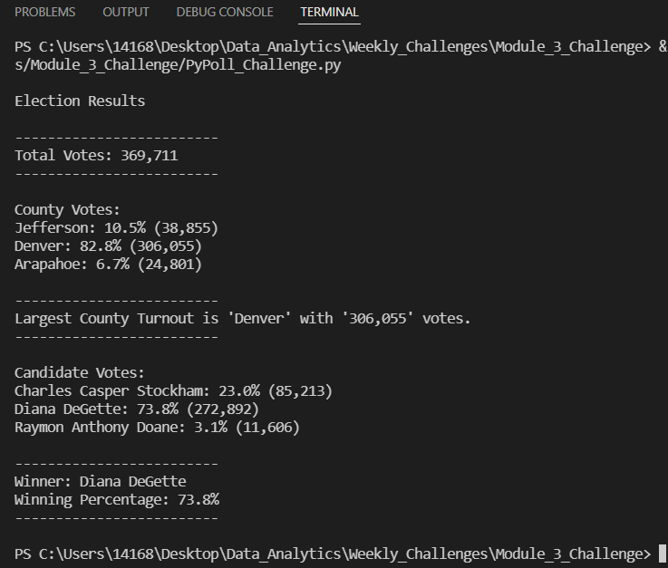
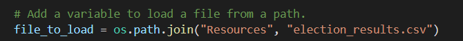
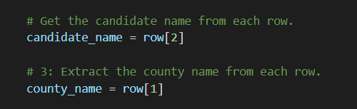

# Election Analysis

## Overview of Election Audit
We are given a raw dataset by the Colorado Election commission containing all the votes. For each vote, there are the Ballot ID, County Name and Candidate Name.
Election Officials need our help to be able to see how each county and each candidate have done in the election. The dataset is a comma separated file with close to 370K rows and it's close to impossible (very time-consuming) to manually get the information the commission needs.

## Election Audit Results
With the help of some scripting, we were able to go through each row of the data and gather the information we need, such as the number of votes each candidate has received.
### *Total Number of Votes:*
Total number of votes cast in this congressional election was counted to be 369,711
>tech note: this task was done by initializing an *accumulator* that would increment by 1 when going through each row but skipping the header row. (code line 46)

### *County Votes:*
We also counted total vote cast by each county and the percentage of the votes by counties:

- Jefferson: 10.5% (38,855)
- Denver: 82.8% (306,055)
- Arapahoe: 6.7% (24,801)

>tech note: this task was done by creating a Dictionary with County Name as Key and another accumulator that would increment by 1 whenever we encountered a vote cast in that county, and finally ending up with the total number of the votes for that county as the Value for that Key.

>tech note 2: finding the percentage was easily done by dividing the number of votes for each county by total votes multiplied by 100 (code line 102)

### *Largest Turnout:*
We determined that the county that had the largest turnout was **Denver**.*

>tech note: for this, we got help from a conditional statement while going through the rows to find the biggest number of votes among the counties. (code line 113)

### *Candidate Votes:*
Then we also were able to get the number of votes for each candidate and were able to calculate the percentage of the votes for each of the candidates: 

- Charles Casper Stockham: 23.0% (85,213)
- Diana DeGette: 73.8% (272,892)
- Raymon Anthony Doane: 3.1% (11,606)

so, we were able to declare the winning candidate of this congressional election along with the vote count and the percentage of the votes received.

### *Election Winner:*
- **Winner:** *Diana DeGette*
- **Winning Vote Count:** *272,892*
- **Winning Percentage:** *73.8%*

>tech note: we used the same idea of what has been done for finding the county votes and percentages to find each candidate's number and percentage of votes. We also used the method that we used to find largest turnout by each county, to be able to find the candidate who received most votes and percentage and could finally declare the winner of this congressional election.

>tech note: When this analysis is run, the output will be displayed on the teminal as well as in a text file which will be given to the Election Commission.

***Text file output:***

***Terminal output:***

## Election Audit Summary
This script can be used over and over for any other elections by just making very minor changes to the script if necessary to adapt to the new dataset.

Since this script reads a CSV dataset, by simply modifying the "file_to_load" path, and adding the new dataset to the resources folder, the officials will be able to reuse this script for another election. 

Also to use this script, they will have to make sure the new dataset has the same structure as the dataset used for this election, but if the fields are in a different order than this one (here we had Ballot Id, County, Candidate Name), they can modify the script to suit their new data set, for example, if the new dataset is like Ballot ID, Candidate Name, County, they can change the script where the row indexes are called and give the correct index number

